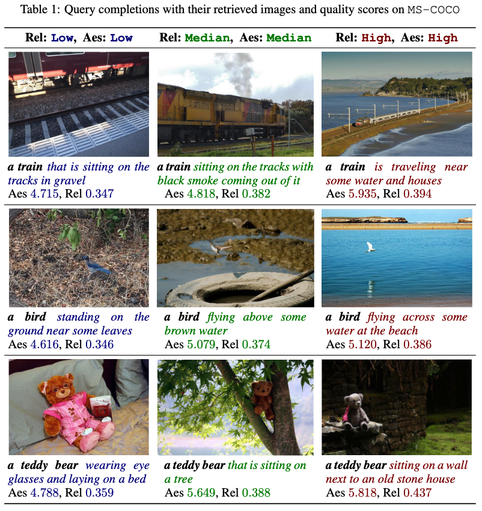
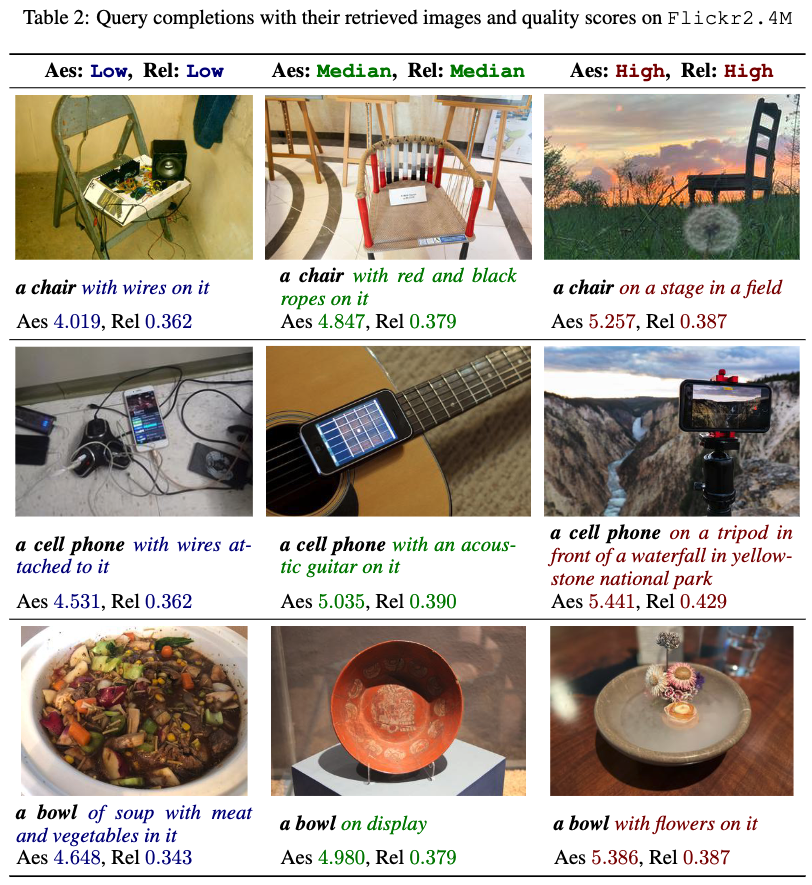

# Seeing Through Words: Controlling Visual Retrieval Quality with Language Models

[](https://openreview.net/forum?id=yOEmEXmbV8)
[](https://huggingface.co/Johnny050407/QCQC/)

**Authors:** [Jianglin Lu](https://jianglin954.github.io/), [Simon Jenni](https://sjenni.github.io/), [Kushal Kafle](https://kushalkafle.com/), [Jing Shi](https://jshi31.github.io/jingshi/), [Handong Zhao](https://hdzhao.github.io/), [Yun Fu](https://www1.ece.neu.edu/~yunfu/)

---

## Why QCQC?

Text-to-image retrieval usually optimizes for **relevance** only. In practice you often care about **quality** too: more aesthetic photos, fewer blurry or low-IQA images, or a custom trade-off. We call this **Quality-Controllable Retrieval (QCR)**, a new setting where retrieval can be explicitly conditioned on user-defined quality requirements.

We propose **Quality-Conditioned Query Completion (QCQC)**, a query completion framework that leverages LLMs to enrich short queries with quality-aware descriptive details. Specify desired quality (e.g., aesthetic, relevance, image quality), and QCQC completes your query so retrieval returns results that match both meaning and quality.

- **Quality control** — Describe desired quality as the condition; no separate filters or post-hoc ranking.
- **Multi-dimensional quality** — Aesthetic, image quality (IQA), and relevance, composable in one framework (adapt to any quality definition).
- **Reproducible** — MS-COCO workflow, clear data pipeline, and training/inference scripts.

---

## Overview

We use **MS-COCO** as the running example: download data, build a search index, generate auxiliary quality scores (aesthetic, IQA, relevance), tokenize and train the QCQC model, then run retrieval. The steps below walk through the full pipeline.

---

## Environment Installation

```bash
bash ./src/setup_envir.sh
conda activate QCQC
```

---

## Dataset Preparation

### Download MS-COCO dataset

```bash
python ./src/download_coco.py
unzip ./coco_data/train2017.zip -d ./coco_data/
unzip ./coco_data/annotations_trainval2017.zip -d ./coco_data/
```

### Build search index

```bash
CUDA_VISIBLE_DEVICES=0 python ./src/search_preparation.py
```

---

## Auxiliary Data Generation

Quality conditioning relies on precomputed scores. Follow the steps below for each type.

### Image Aesthetic Scores

Follow the setup in [improved-aesthetic-predictor](https://github.com/christophschuhmann/improved-aesthetic-predictor).

Install extra dependencies:

```bash
conda run -n QCQC pip install webdataset pytorch-lightning
```

Generate aesthetic scores:

```bash
CUDA_VISIBLE_DEVICES=0 python ./improved-aesthetic-predictor/simple_inference_coco.py
```

### IQA Scores

Follow the setup in [DeQA-Score](https://github.com/zhiyuanyou/DeQA-Score). Create a separate environment:

```bash
conda create -yn DeQA python=3.10
conda activate DeQA
cd DeQA-Score
pip install -e .
pip install pycocotools numpy==1.26.4 protobuf
```

Generate IQA scores:

```bash
CUDA_VISIBLE_DEVICES=0 python ./src/evaluate/scorer_coco.py
```

### Relevance Scores

Relevance scores are computed with CLIP. From the QCQC environment:

```bash
conda activate QCQC
CUDA_VISIBLE_DEVICES=0 python ./src/generate_relevance_scores.py
```

---

## Training & Testing

### 1. Data tokenization

```bash
CUDA_VISIBLE_DEVICES=0 python ./src/run_tokenize.py
```

### 2. Model training

Multi-GPU example (8 GPUs):

```bash
torchrun --nproc_per_node=8 --master_port=1221 ./src/train.py \
    --lr 2e-3 --warmup 100 --epochs 20 --bs 256 \
    --logstep 100 --evalstep 100 --savestep 100 \
    --project_name GPT2_COCO --run_name prompt_gpt2coco
```

### 3. Model testing

```bash
bash src/inference.sh 
```

---


## Pretrained Checkpoints and Processed Data

Pretrained checkpoints and preprocessed auxiliary data for MS-COCO are publicly available on Hugging Face:

https://huggingface.co/Johnny050407/QCQC/


---


## Results

Qualitative examples of quality-conditioned retrieval:

|  |  |
|:---:|:---:|
|  |  |
| *Quality-conditioned retrieval examples (1)* | *Quality-conditioned retrieval examples (2)* |

---

## Citation

If you use this code or idea in your work, please cite:

```bibtex
@inproceedings{JianglinQCQC2026,
  title     = {Seeing Through Words: Controlling Visual Retrieval Quality with Language Models},
  author    = {Jianglin Lu and Simon Jenni and Kushal Kafle and Jing Shi and Handong Zhao and Yun Fu},
  booktitle = {The Fourteenth International Conference on Learning Representations (ICLR)},
  year      = {2026},
  url       = {https://openreview.net/forum?id=yOEmEXmbV8},
}
```

---

## Acknowledgement

We use the following open-source projects and thank the authors:

- [improved-aesthetic-predictor](https://github.com/christophschuhmann/improved-aesthetic-predictor) for aesthetic quality evaluation
- [DeQA-Score](https://github.com/zhiyuanyou/DeQA-Score) for IQA score prediction
